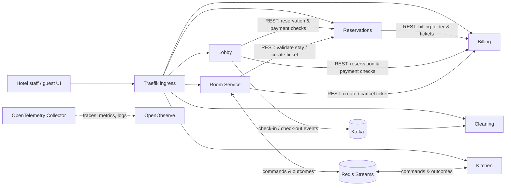
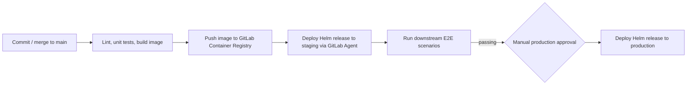
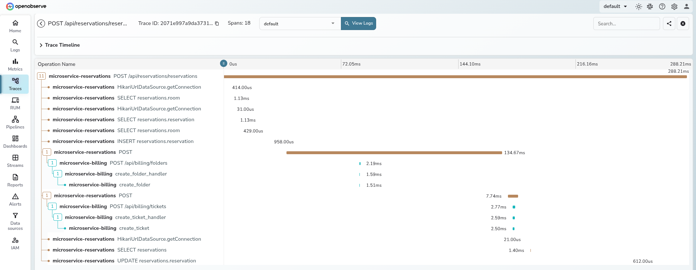
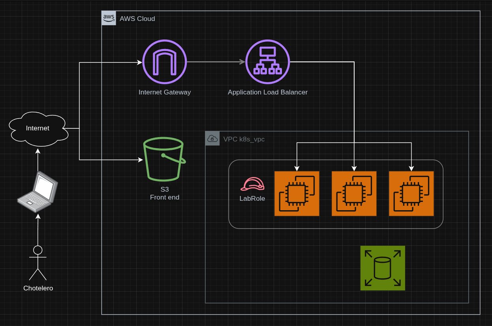

# CHotel | Distributed Hotel Management Platform

A polyglot hotel-management system built as six independently deployable microservices. It combines synchronous REST APIs, asynchronous event-driven workflows, compensating transactions, end-to-end delivery pipelines, and Kubernetes infrastructure on AWS.

CHotel was a final group project for the **Microservice Architectures** course at ITBA. The goal was not simply to split a CRUD application into services; we designed bounded contexts with Domain-Driven Design and Event Storming, made them communicate across boundaries, and used GitLab CI/CD pipelines to automate their delivery to a Kubernetes cluster running on AWS EC2.

The original project was developed in private GitLab repositories. This repository consolidates a final snapshot of each of the nine repositories that made up the system.

## What makes this project interesting

- **Technologically diverse:** the six microservices were implemented with a wide array of different languages and databases: Rust, Java, Python, and Go, PostgreSQL, MongoDB, as well as Redis and Kafka.
- **Real distributed workflows:** REST is used where an immediate decision is needed; Kafka and Redis Streams decouple lifecycle updates and long-running work.
- **Business consistency without a shared database:** the Room Service flow is orchestrated as a distributed transaction with explicit confirmation, cancellation, and compensation paths.
- **Delivery as part of the system:** every service has its own GitLab CI/CD pipeline, Helm chart, isolated Kubernetes namespaces, staging deployment, E2E test gate, and production promotion.
- **Designed to be observable:** OpenTelemetry traces, metrics, and structured logs are collected centrally in OpenObserve, including context propagated through asynchronous messaging.

## System at a glance

Each service owns its data. PostgreSQL backs transactional domains, MongoDB supports Lobby's document-oriented workflow, and Redis supports both Kitchen state and the Room Service messaging streams. Services never read each other's databases.

## Bounded contexts and services

| Service | Responsibility | Tech stack | Key integrations |
| --- | --- | --- | --- |
| **Reservations** | Room inventory, availability, and the reservation lifecycle. | Java, Micronaut, PostgreSQL | Creates the billing folder associated with a stay; queried by Lobby and Room Service. |
| **Billing** | Ticket folders, individual charges, payment state, and outstanding-balance checks. | Rust, Axum, PostgreSQL | Synchronous API consumed by Reservations, Lobby, Cleaning, and Room Service. |
| **Lobby** | Check-in and check-out workflows, including reservation and payment validation. | Python, FastAPI, MongoDB | Calls Reservations and Billing; publishes room-lifecycle events. |
| **Cleaning** | Room occupancy, cleaning work, staff workflow, and damage reporting. | Java, Micronaut, PostgreSQL | Consumes `check-in` and `check-out` Kafka events; can create damage charges through Billing. |
| **Room Service** | Menu, guest orders, order state, and the distributed order workflow. | Go, Gin, PostgreSQL + Redis Streams | Orchestrates Reservations, Billing, and Kitchen. |
| **Kitchen** | Kitchen work queue, preparation state, and ingredient stock validation. | Java, Quarkus, Redis | Consumes and emits Room Service workflow messages through Redis Streams. |

## Distributed transaction: a room-service order

The room-service order demonstrates the architectural trade-off at the center of the project. A conventional database transaction cannot atomically span Room Service, Kitchen, and Billing, so **Room Service acts as the orchestrator** and preserves business consistency with state transitions and compensating operations.

1. A guest creates an order. Room Service validates the stay and persists the pending order.
2. It sends an order command through a queue. Kitchen validates the menu and available stock, then accepts or rejects the request.
3. After Kitchen accepts, Room Service creates the corresponding charge in the reservation's Billing folder through Billing's REST API.
4. On success, Room Service publishes confirmation and Kitchen begins preparation. Kitchen later emits preparation/completion outcomes asynchronously.
5. If a dependency rejects or fails the operation, the orchestrator marks the order as cancelled. If a billing ticket was already created, it explicitly cancels that ticket; the reservation's billing folder is retained because it belongs to the stay, not to the order.

This is a saga-style, orchestrated distributed transaction rather than a cross-service ACID transaction. It makes the failure handling visible in the domain model: `pending`, `preparing`, `completed`, and `cancelled` are meaningful business states, not incidental implementation details.

The other event-driven workflow is room occupancy: Lobby publishes `check-in` and `check-out` events to Kafka, and Cleaning consumes them to keep its local view and cleaning schedule up to date. Trace context is propagated with the events so an operator can follow the work across service boundaries.

## Deployment and delivery pipeline

The project used a **multi-repository** setup because every service has a different toolchain and release lifecycle. The same deployment shape is repeated across services while leaving each pipeline free to run its native build and test steps.

- GitLab Agents provide the CI jobs with controlled access to the Kubernetes clusters; the pipeline runs `kubectl` and `helm` through the agent rather than exposing cluster credentials to every repository.
- Staging and production use separate namespaces for each microservice, preventing cross-environment service-discovery and configuration collisions.
- A service change automatically deploys to staging and triggers the dedicated downstream E2E test repository. Production deployment is deliberately a manual approval after those tests pass.
- Helm charts package the Deployments, Services, Ingress routes, resource configuration, and environment-specific dependency URLs for each service.

## Infrastructure and observability

Terraform provisions the AWS foundation, including EC2 instances for the Kubernetes cluster and the S3-hosted frontend. The shared-infrastructure repository then deploys the platform components as Helm releases:

- PostgreSQL, MongoDB, Redis, and Kafka
- Traefik ingress controller, exposed through an AWS Application Load Balancer
- AWS EBS CSI driver and a gp3-backed StorageClass for persistent workloads
- OpenTelemetry Collector and OpenObserve for traces, metrics, and structured logs

The architecture intentionally treats observability as a first-class platform concern. Services export telemetry through OTLP to the Collector, which forwards it to OpenObserve. That makes a cross-service request diagnosable from one trace instead of a hunt through six unrelated log streams.

  

  

## Repository map

| Directory | Contents |
| --- | --- |
| `microservice-billing` | Rust/Axum billing API and Helm release. |
| `microservice-cleaning` | Micronaut cleaning workflow and Kafka consumer. |
| `microservice-reservations` | Micronaut reservations and availability domain. |
| `microservice-kitchen` | Quarkus kitchen and Redis-backed order processing. |
| `microservice-lobby` | FastAPI check-in/check-out service and Kafka producer. |
| `microservice-roomservice` | Go room-service domain, order orchestrator, and Redis Streams integration. |
| `shared-infrastructure` | Terraform, Helm charts, ingress, storage, messaging, databases, and observability stack. |
| `end-2-end-tests` | Bun/TypeScript scenarios that validate reservation, room-service, and cleaning flows. |
| `chotel-front` | Minimal static frontend used for the project demo. |

## End-to-end tests

The E2E test suite validates business flows against the staging environment rather than testing services in isolation. Representative scenarios include:

- Creating and confirming a reservation while preventing double-booking;
- Checking a guest in and out, then verifying the resulting Kafka lifecycle events and cleaning work;
- Creating a room-service order, asserting Kitchen messaging and Billing ticket creation, completing the order, and checking out.